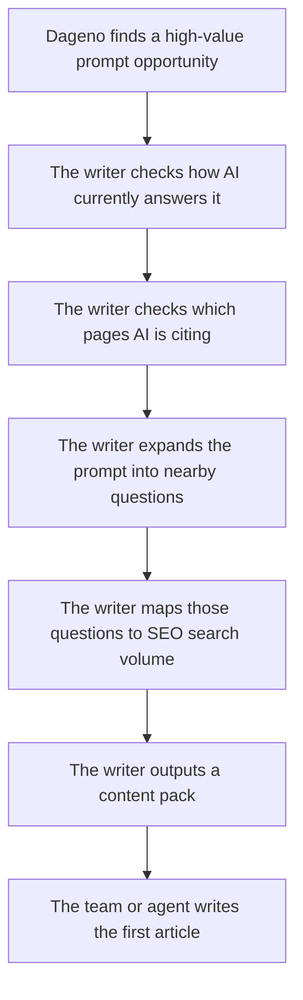

[](LICENSE)
[](skills/content-writer.md)
[](references/pipeline-spec.md)

# GEO Content Writer


> A GEO-first content writer that turns Dageno opportunity data into structured content packs for ongoing article generation, future landing pages, and agent-driven execution.

## What This Project Does

This project helps a team answer one simple question:

> "If AI tools are already talking about our category, what should we publish next so our brand gets included?"

Instead of starting from a plain keyword list, this writer starts from **GEO evidence**:

- which prompts AI is already answering
- where the brand is missing
- which third-party pages AI is citing
- which adjacent prompt ideas exist around the same topic
- which SEO terms map to that opportunity

The result is not just one article title.

The result is a **content pack**: a small, prioritized set of writing opportunities that a team or agent can execute.

## Why This Matters

Most content tools tell teams what people search.

This project tells teams something more useful for GEO:

- where AI is already shaping the market narrative
- where competitors or third-party sources are winning that narrative
- where the brand is absent from high-value AI answers

One of the most important insights here is:

**a high-value GEO opportunity does not always have high prompt volume**

That is exactly why Dageno data is useful.

## About Dageno

[Dageno](https://dageno.ai) is a GEO and AI visibility platform for brands that want to understand how AI systems such as ChatGPT, Gemini, Perplexity, Copilot, and Google AI products talk about their business.

It helps teams monitor:

- prompt-level brand visibility
- prompt-level brand gaps and source gaps
- response detail
- citation patterns
- content opportunities

Open API docs:

- [Dageno Open API](https://open-api-docs.dageno.ai/2055134m0)

This project uses Dageno as the data foundation for automated content writing decisions.

## Who This Is For

This project is built for:

- teams that want to automate GEO-driven article generation
- agencies that want a repeatable GEO writing workflow for clients
- marketers who need a simple answer to "what should we publish next?"
- operators who want a content pack before they start writing

## Inputs

At a simple level, the engine needs three kinds of inputs.

### 1. GEO opportunity data from Dageno

- `List content opportunities`
- `List prompts`
- `List responses by prompt`
- `Get response detail by prompt`
- `List citation URLs by prompt`
- `List query fanout by prompt`

### 2. SEO enrichment

- keyword extraction
- keyword expansion
- `Get keyword volume` from the API

In customer-facing language, this is **search volume**.

### 3. Product positioning context

The writer also needs a basic understanding of:

- what the brand does
- which category it wants to win
- which commercial angle matters most

## Outputs

The output is a **content pack**.

A content pack usually includes:

- one selected prompt opportunity
- a short explanation of why it matters
- a fanout set of nearby prompt ideas
- a search-volume view of related SEO phrases
- a recommended asset list
- a suggested writing order

From there, a team can decide whether to generate:

- a blog article
- a landing page
- a comparison page
- a docs page
- a community-style post

## A Simple Customer Flow

Imagine a customer wants GEO-based article ideas.

The workflow should feel this simple:



## Example Input And Output

Here is a simple example of how the data moves.

### Input

A customer wants article ideas around this prompt:

- `Enterprise AEO solutions for brand authority`

Dageno shows:

- high brand gap
- high source gap
- many AI responses
- many cited third-party URLs

The writer then pulls:

- response detail
- citation URLs
- fanout queries
- related SEO phrases and search volume

### Output

The engine returns a content pack such as:

1. `What Is an Enterprise AEO Solution?`
2. `How to Evaluate Enterprise AEO Platforms`
3. `Best Enterprise AEO Solutions for Brand Authority`
4. `How to Measure Brand Authority in AI Answers`
5. `Enterprise AEO Platform for Brand Authority`

This means the customer does not need to manually decide:

- which angle to write
- which query to expand
- which article should come first

The writer turns one GEO opportunity into a usable publishing queue.

## End-to-End Content Logic

For customers, the whole flow can be understood in 5 steps:

1. Dageno finds a strong GEO opportunity.
2. The writer checks how AI is answering that topic now.
3. The writer checks which sources AI trusts.
4. The writer expands the topic into adjacent prompt and SEO opportunities.
5. The writer outputs a prioritized content pack.

## Recommended Asset List Schema

This table is the operational core of the system.

| Column | Meaning |
|---|---|
| `asset_id` | unique row id |
| `source_prompt` | source seed prompt |
| `opportunity_tier` | High / Medium / Low |
| `asset_title` | recommended title |
| `asset_type` | article / landing_page / docs / comparison / community |
| `recommended_publish_surface` | where to publish |
| `target_intent` | Transactional / Commercial / Informational / Navigational |
| `primary_angle` | main angle |
| `why_exists` | why this asset exists |
| `derived_from` | normalized source signals |
| `writing_inputs` | required writing inputs |
| `priority` | high / medium / low |
| `status` | planned / queued / writing / published |
| `notes` | optional notes |

## GEO Data Value, Explicitly

This project should make Dageno's GEO value obvious.

The platform is useful because it helps answer questions such as:

- which commercially important prompts exclude the brand entirely
- which answer spaces are already shaped by third-party sources
- which content formats AI systems already trust
- which adjacent prompts deserve new content
- which content assets should exist before writing begins

That is more valuable than a plain keyword list.

## GEO Writing Standard

When an asset row is turned into actual content, follow these rules:

1. Start with a direct definition or answer.
2. Make each H2 understandable without the rest of the page.
3. Put the answer before the explanation.
4. Keep one core idea per paragraph.
5. Prefer lists, tables, steps, and comparisons when useful.
6. Name entities and capabilities explicitly.
7. Use FAQ as an extraction layer.
8. Write in a way that can be quoted by AI systems as a standalone answer.

## Live Commands

### Basic opportunity view

```bash
cd geo-content-writer
python -m venv .venv
source .venv/bin/activate
pip install -r requirements.txt
export DAGENO_API_KEY="your-token"
PYTHONPATH=src python -m geo_content_writer.cli content-opportunities --days 7
```

### Full content pack

```bash
PYTHONPATH=src python -m geo_content_writer.cli content-pack --days 7
```

### Target one prompt

```bash
PYTHONPATH=src python -m geo_content_writer.cli content-pack --days 7 --prompt-text "Enterprise AEO solutions for brand authority"
```

## Repo Structure

```text
geo-content-writer/
├── README.md
├── LICENSE
├── manifest.json
├── agents/
│   └── openai.yaml
├── skills/
│   └── content-writer.md
├── references/
│   └── pipeline-spec.md
├── assets/
├── examples/
└── src/
```

## License

MIT
