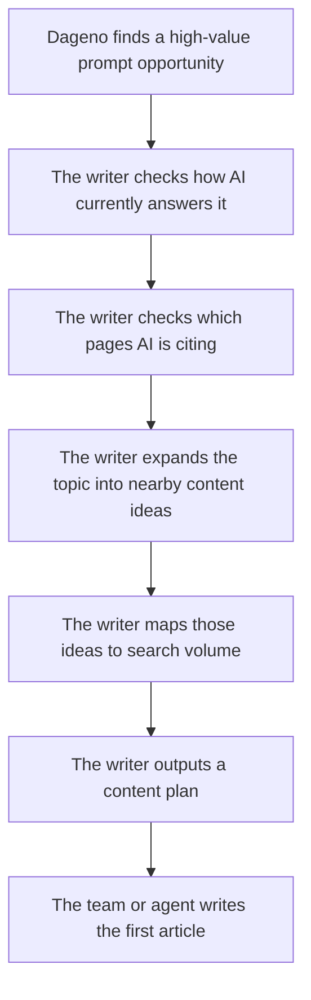

[](LICENSE)
[](skills/content-writer.md)
[](https://open-api-docs.dageno.ai/2055134m0)
[](examples/live-30-day-example.md)

<div align="center">
  
  <h1>GEO Content Writer</h1>
  <p><strong>Turn GEO opportunities into a repeatable publishing system.</strong></p>
  <p>GEO Content Writer is a <strong>Content Writer Skill backed by a CLI runtime</strong>. It uses Dageno data to find high-value AI-search opportunities, explain why they matter, and turn them into a ready-to-use content plan.</p>
  <p>
    <a href="https://open-api-docs.dageno.ai/2055134m0">Open API Docs</a> •
    <a href="skills/content-writer.md">Skill Instructions</a> •
    <a href="references/pipeline-spec.md">Workflow Reference</a> •
    <a href="examples/live-30-day-example.md">Live Example</a> •
    <a href="https://dageno.ai">Book a Demo</a>
  </p>
</div>


## Quick Links

- [Dageno Open API](https://open-api-docs.dageno.ai/2055134m0)
- [Skill Instructions](skills/content-writer.md)
- [Workflow Reference](references/pipeline-spec.md)
- [Live Example Output](examples/live-30-day-example.md)
- [Cursor MCP Example](examples/cursor-mcp.json)
- [Book a Demo](https://dageno.ai)

## What This Project Does

This project helps teams answer a simple question:

> If AI is already talking about a topic that matters to the business, what should be published next so the brand gets included?

Instead of starting from a plain keyword list, GEO Content Writer starts from:

- prompt-level brand gaps
- prompt-level source gaps
- real AI responses
- cited URLs
- fanout prompts
- related search demand

The output is not just one article title.

The output is a **content plan** that tells a team:

- what to write
- why it matters
- where to publish it
- what should be written first

## Why This Matters

Most SEO writing tools answer:

- what keyword should be targeted

This project answers harder and more valuable questions:

- where AI is already shaping the market narrative
- where the brand is missing from high-value AI answers
- which third-party sources are winning that narrative
- which nearby topics deserve new content
- how to turn one GEO opportunity into a full publishing queue

One important insight behind this workflow is:

**a high-value GEO opportunity does not always have high prompt volume**

That is one of the clearest examples of why Dageno data is valuable.

## About Dageno

[Dageno](https://dageno.ai) is a GEO and AI visibility platform for brands that want to understand how AI systems like ChatGPT, Gemini, Perplexity, Copilot, and Google AI products talk about their business.

Dageno helps teams monitor:

- prompt-level brand visibility
- brand gaps and source gaps
- response detail
- citation patterns
- content opportunities
- fanout prompt opportunities

This project uses Dageno as the data foundation for automated content writing decisions.

## Contact

Public contact paths currently shown on the Dageno website footer:

- [Schedule a demo](https://dageno.ai)
- [Slack Community](https://join.slack.com)
- [About Dageno](https://dageno.ai)

The footer also indicates support availability across:

- Email
- Chat
- Phone
- Slack

## Who This Is For

This project is built for:

- marketing teams that want GEO-based article ideas
- agencies that want a repeatable GEO writing workflow for clients
- operators who need a content plan before they start writing
- teams that want to automate content generation without losing strategic context

## 10-Second View

| Input | Output |
|---|---|
| one high-value GEO prompt opportunity from Dageno | one ready-to-use content plan |
| AI response detail | a clear explanation of what AI is saying now |
| citation URLs | a view of which sources are shaping that answer |
| fanout queries | nearby content opportunities |
| search volume | the SEO demand around those opportunities |
| one approved topic | the first article to write |

## Simple Customer Flow

Imagine a customer wants GEO-based article ideas.

The workflow should feel this simple:



## Example Input And Output

### Input

A customer wants GEO-driven article ideas around:

- `Enterprise AEO solutions for brand authority`

Dageno shows:

- high brand gap
- high source gap
- many AI responses
- many cited third-party URLs

The writer then pulls:

- response detail
- citation URLs
- fanout queries
- related SEO phrases and search volume

### Output

The engine returns a content plan such as:

1. `What Is an Enterprise AEO Solution?`
2. `How to Evaluate Enterprise AEO Platforms`
3. `Best Enterprise AEO Solutions for Brand Authority`
4. `How to Measure Brand Authority in AI Answers`
5. `Enterprise AEO Platform for Brand Authority`

This means the customer does not need to manually decide:

- which angle to write
- which query to expand
- which article should come first

The writer turns one GEO opportunity into a usable publishing queue.

## Real Example

Here is a real-style example of how a team could use this workflow.

### Input

Selected GEO opportunity:

- `Enterprise AEO solutions for brand authority`

What Dageno shows:

- brand gap is high
- source gap is high
- AI is already answering this topic across major platforms
- third-party pages are shaping the answer space

### What The Writer Finds

After checking response detail, citation URLs, fanout, and search-side signals, the writer can summarize the situation like this:

- AI already understands the topic
- AI is willing to cite many third-party sources in this category
- the brand is still missing from that answer landscape
- the opportunity is strong enough to justify multiple content assets, not just one article

### Output

The system turns that one GEO opportunity into a content plan like this:

| Title | Type | Publish Surface | Why It Exists | Priority |
|---|---|---|---|---|
| What Is an Enterprise AEO Solution? | Article | Website blog | AI repeatedly answers this as a category-definition question | High |
| How to Evaluate Enterprise AEO Platforms | Article | Website blog | The prompt is close to solution evaluation and purchase behavior | High |
| Best Enterprise AEO Solutions for Brand Authority | Article | Website blog or third-party article | AI already cites roundup-style content in this space | High |
| How to Measure Brand Authority in AI Answers | Article | Website blog | Buyers need a measurable framework, not only a definition | Medium |
| Enterprise AEO Platform for Brand Authority | Landing page | Landing page | This can become the future conversion page | Medium |

### First Writing Task

The team or agent can then start with:

- `What Is an Enterprise AEO Solution?`

This makes the workflow easy to operationalize:

1. pick one real GEO opportunity
2. let the writer build the content plan
3. approve the top item
4. generate the first article

## Inputs

At a simple level, the engine needs three kinds of inputs.

### 1. GEO opportunity data from Dageno

- `List content opportunities`
- `List prompts`
- `List responses by prompt`
- `Get response detail by prompt`
- `List citation URLs by prompt`
- `List query fanout by prompt`

### 2. SEO enrichment

- keyword extraction
- keyword expansion
- `Get keyword volume`

In customer-facing language, this is **search volume**.

### 3. Product positioning context

The writer also needs a basic understanding of:

- what the brand does
- which category it wants to win
- which commercial angle matters most

## Outputs

The primary output is a **content plan**.

A content plan usually includes:

- one selected prompt opportunity
- a short explanation of why it matters
- a fanout set of nearby prompt ideas
- a search-volume view of related SEO phrases
- a recommended asset list
- a suggested writing order

From there, a team can decide whether to generate:

- a blog article
- a landing page
- a comparison page
- a docs page
- a community-style post

## What The Customer Actually Gets

The most useful output is a **content plan table**.

This is the working queue that a marketing team or writing agent can use directly.

### Example Content Plan

| Title | Type | Publish Surface | Why This Matters | Priority |
|---|---|---|---|---|
| What Is an Enterprise AEO Solution? | Article | Website blog | AI keeps answering this question, but the brand is still missing | High |
| How to Evaluate Enterprise AEO Platforms | Article | Website blog | This is a strong buyer-intent angle close to solution selection | High |
| Best Enterprise AEO Solutions for Brand Authority | Article | Website blog or third-party article | AI already cites roundup-style content in this topic area | High |
| How to Measure Brand Authority in AI Answers | Article | Website blog | This helps turn abstract authority into measurable outcomes | Medium |
| Enterprise AEO Platform for Brand Authority | Landing page | Landing page | This can become the commercial conversion page later | Medium |

### Full Table Structure

If a team wants the detailed version, the content plan table can include:

| Column | Meaning |
|---|---|
| `asset_id` | internal row id |
| `source_prompt` | the GEO prompt that created this plan |
| `opportunity_tier` | High / Medium / Low |
| `asset_title` | suggested title |
| `asset_type` | article / landing page / docs / comparison / community |
| `recommended_publish_surface` | where the content should be published |
| `target_intent` | the search or buying intent behind it |
| `primary_angle` | the main angle of the piece |
| `why_exists` | the reason this item is in the plan |
| `derived_from` | the key signals that created the idea |
| `writing_inputs` | the data the writer should use |
| `priority` | what should be written first |
| `status` | planned / queued / writing / published |
| `notes` | optional notes |

## GEO Data Value

This project makes Dageno's GEO value explicit.

The platform is useful because it helps answer questions such as:

- which commercially important prompts exclude the brand entirely
- which answer spaces are already shaped by third-party sources
- which content formats AI systems already trust
- which adjacent prompts deserve new content
- which content assets should exist before writing begins

That is more valuable than a plain keyword list.

## GEO Writing Standard

When a row from the content plan is turned into actual content, follow these rules:

1. Start with a direct definition or answer.
2. Make each H2 understandable without the rest of the page.
3. Put the answer before the explanation.
4. Keep one core idea per paragraph.
5. Prefer lists, tables, steps, and comparisons when useful.
6. Name entities and capabilities explicitly.
7. Use FAQ as an extraction layer.
8. Write in a way that can be quoted by AI systems as a standalone answer.

## Quick Start

### Basic opportunity view

```bash
cd geo-content-writer
python -m venv .venv
source .venv/bin/activate
pip install -r requirements.txt
export DAGENO_API_KEY="your-token"
PYTHONPATH=src python -m geo_content_writer.cli content-opportunities --days 7
```

### Full content pack

```bash
PYTHONPATH=src python -m geo_content_writer.cli content-pack --days 7
```

### Target one prompt

```bash
PYTHONPATH=src python -m geo_content_writer.cli content-pack --days 7 --prompt-text "Enterprise AEO solutions for brand authority"
```

## Project Structure

```text
geo-content-writer/
├── README.md
├── LICENSE
├── manifest.json
├── agents/
│   └── openai.yaml
├── skills/
│   └── content-writer.md
├── references/
│   └── pipeline-spec.md
├── assets/
├── examples/
└── src/
```

## Technical Notes

This project is best understood as:

- a **Content Writer Skill** for agent workflows
- backed by a **CLI runtime** for real API execution

That means:

- the skill defines the workflow and writing rules
- the CLI executes the Dageno and SEO data steps

## License

MIT
