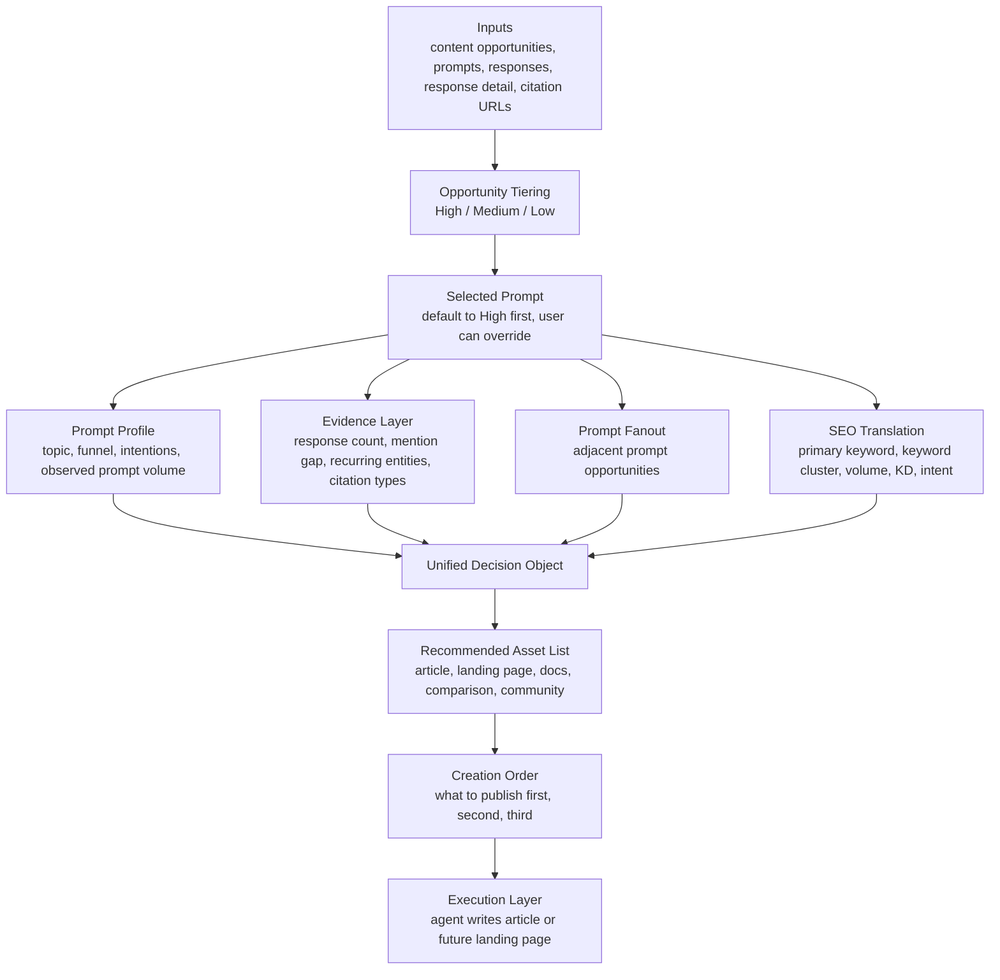

[](LICENSE)
[](skills/content-writer.md)
[](references/pipeline-spec.md)

# GEO Content Writer


> A GEO-first content writer that turns Dageno opportunity data into structured content packs for ongoing article generation, future landing pages, and agent-driven execution.

## Positioning

This project is intentionally different from a traditional SEO content engine.

Your other project, `seo-geo-content-engine`, starts from keyword-side demand and content production.

This project starts from **GEO evidence**:

- AI answer gaps
- source gaps
- response detail
- citation URLs
- prompt fanout

Then it translates that GEO evidence into content production decisions.

That is why the correct positioning for this repo is:

**GEO Content Writer**

This naming is intentionally aligned with the platform-side writing agent:

- platform agent: `content writer`
- open project: `GEO Content Writer`

## What Makes This Valuable

The core Dageno value is not just "finding prompts."

It is helping teams discover:

- prompts where AI is repeatedly answering a high-value question
- prompts where competitors or adjacent entities appear but your brand does not
- prompts where source ecosystems are already formed without you
- prompts where raw prompt volume may still look low, but the business value is high

This matters because:

**high-value content opportunities do not always have high prompt volume**

That is one of the strongest GEO-specific signals this project can surface.

## Inputs

This engine depends on a mix of Dageno-native data and extensible enrichment layers.

### Required GEO inputs

- `List content opportunities`
- `List prompts`
- `List responses by prompt`
- `Get response detail by prompt`
- `List citation URLs by prompt`

### GEO enrichment

- `List query fanout by prompt`

### SEO enrichment

- `Get keyword volume`
- keyword extraction
- keyword expansion
- keyword intent normalization
- future KD connector

## Outputs

The main output is not one article.

The main output is a **content pack** that contains:

- opportunity tiers
- selected prompt
- prompt profile
- evidence layer
- fanout layer
- SEO layer
- recommended asset list
- creation order

Then the user or an agent can choose:

- article generation
- future landing page generation
- future supporting asset generation

## Why GEO Data Changes The Workflow

A normal SEO workflow often asks:

- what keyword has search demand
- what page should we write

This GEO-first workflow asks:

- what high-value prompt is AI already answering
- where is our brand missing
- which sources are shaping the answer
- what adjacent prompt demand exists
- what content pack should be created to enter that answer space

That is a much stronger story for Dageno than generic keyword research.

## Flow Overview



## End-to-End Content Flow

### 1. Opportunity Tiering

All prompts should first be classified into:

- `High Opportunity`
- `Medium Opportunity`
- `Low Opportunity`

The engine should default to `High` first.

### 2. Prompt Profile

For the selected prompt, capture:

- prompt id
- prompt text
- topic
- funnel
- intentions
- observed prompt volume

### 3. Evidence Layer

Use:

- response list
- response detail
- citation URLs

To answer:

- is the gap real
- is it stable
- how is AI framing the topic
- what entities are filling the space
- what page types dominate the citation layer

### 4. Fanout Layer

Use:

- `List query fanout by prompt`

To expand one prompt into adjacent prompt opportunities.

This is the bridge between:

- one opportunity
- and a reusable content pack

### 5. SEO Layer

Use:

- primary keyword extraction
- keyword cluster expansion
- `Get keyword volume`
- future KD connector
- intention mapping

To turn GEO-side evidence into SEO-side decisions.

### 6. Content Pack

Combine the GEO layer and SEO layer into:

- one reusable content pack
- one recommended asset list
- one creation order

## Recommended Asset List Schema

This table is the operational core of the system.

| Column | Meaning |
|---|---|
| `asset_id` | unique row id |
| `source_prompt` | source seed prompt |
| `opportunity_tier` | High / Medium / Low |
| `asset_title` | recommended title |
| `asset_type` | article / landing_page / docs / comparison / community |
| `recommended_publish_surface` | where to publish |
| `target_intent` | Transactional / Commercial / Informational / Navigational |
| `primary_angle` | main angle |
| `why_exists` | why this asset exists |
| `derived_from` | normalized source signals |
| `writing_inputs` | required writing inputs |
| `priority` | high / medium / low |
| `status` | planned / queued / writing / published |
| `notes` | optional notes |

## GEO Data Value, Explicitly

This project should make Dageno's GEO value obvious.

The platform is useful because it helps answer questions such as:

- which commercially important prompts exclude the brand entirely
- which answer spaces are already shaped by third-party sources
- which content formats AI systems already trust
- which adjacent prompts deserve new content
- which content assets should exist before writing begins

That is more valuable than a plain keyword list.

## GEO Writing Standard

When an asset row is turned into actual content, follow these rules:

1. Start with a direct definition or answer.
2. Make each H2 understandable without the rest of the page.
3. Put the answer before the explanation.
4. Keep one core idea per paragraph.
5. Prefer lists, tables, steps, and comparisons when useful.
6. Name entities and capabilities explicitly.
7. Use FAQ as an extraction layer.
8. Write in a way that can be quoted by AI systems as a standalone answer.

## Live Commands

### Basic opportunity view

```bash
cd geo-content-writer
python -m venv .venv
source .venv/bin/activate
pip install -r requirements.txt
export DAGENO_API_KEY="your-token"
PYTHONPATH=src python -m geo_content_writer.cli content-opportunities --days 7
```

### Full content pack

```bash
PYTHONPATH=src python -m geo_content_writer.cli content-pack --days 7
```

### Target one prompt

```bash
PYTHONPATH=src python -m geo_content_writer.cli content-pack --days 7 --prompt-text "Enterprise AEO solutions for brand authority"
```

## Repo Structure

```text
geo-content-writer/
├── README.md
├── LICENSE
├── manifest.json
├── agents/
│   └── openai.yaml
├── skills/
│   └── content-writer.md
├── references/
│   └── pipeline-spec.md
├── assets/
├── examples/
└── src/
```

## License

MIT
