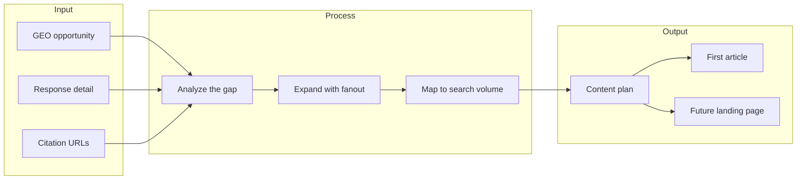

[](LICENSE)
[](skills/content-writer.md)
[](https://open-api-docs.dageno.ai/2055134m0)
[](examples/live-30-day-example.md)

# GEO Content Writer

<div align="center">
  <h2>content writer</h2>
  <p><strong>Turn GEO opportunities into a repeatable publishing system.</strong></p>
  <p>GEO Content Writer is a <strong>Content Writer Skill backed by a CLI runtime</strong>. It uses Dageno data to find high-value AI-search opportunities, explain why they matter, and turn them into a ready-to-use content plan.</p>
  <p><strong>Best for:</strong> GEO teams, agencies, AI visibility operators, and brands that want to automate article planning from real AI-search gaps.</p>
  <p><strong>Core output:</strong> one GEO opportunity in, one ready-to-use content plan out.</p>
  <p>
    <a href="https://open-api-docs.dageno.ai/2055134m0">Open API Docs</a> •
    <a href="skills/content-writer.md">Skill Instructions</a> •
    <a href="references/pipeline-spec.md">Workflow Reference</a> •
    <a href="schemas/output_schema.json">Output Schema</a> •
    <a href="examples/live-30-day-example.md">Live Example</a> •
    <a href="https://dageno.ai">Book a Demo</a> •
    <a href="https://www.linkedin.com/company/dageno-ai">LinkedIn</a> •
    <a href="https://x.com/dageno_ai">X</a> •
    <a href="https://join.slack.com/t/dagenoai/shared_invite/zt-3t3pk34g4-2vpE90vKJ~jBTc31Z0bT8A">Slack Community</a>
  </p>
</div>


## What This Project Does

This project helps teams answer a simple question:

> If AI is already talking about a topic that matters to the business, what should be published next so the brand gets included?

Instead of starting from a plain keyword list, GEO Content Writer starts from:

- prompt-level brand gaps
- prompt-level source gaps
- real AI responses
- cited URLs
- fanout prompts
- related search demand

The output is not just one article title.

The output is a **content plan** that tells a team:

- what to write
- why it matters
- where to publish it
- what should be written first

Before this workflow is used seriously, the team should set a brand knowledge base at:

- `knowledge/brand/brand-knowledge-base.json`

That file is the shared source of truth for:

- brand positioning
- differentiators
- proof points
- claims to avoid
- CTA direction

By default, the writer should work from **today's content opportunities**.
If needed, the time window can be expanded, for example to the last 7 or 30 days.

## Why This Matters

Most SEO writing tools answer:

- what keyword should be targeted

This project answers harder and more valuable questions:

- where AI is already shaping the market narrative
- where the brand is missing from high-value AI answers
- which third-party sources are winning that narrative
- which nearby topics deserve new content
- how to turn one GEO opportunity into a full publishing queue

One important insight behind this workflow is:

**a high-value GEO opportunity does not always have high prompt volume**

That is one of the clearest examples of why Dageno data is valuable.

## About Dageno

[Dageno](https://dageno.ai) is a data-driven GEO and marketing agent platform for brands that want to understand how AI systems like ChatGPT, Gemini, Perplexity, Copilot, and Google AI products talk about their business, and then turn those insights into marketing execution.

Dageno helps teams monitor:

- prompt-level brand visibility
- brand gaps and source gaps
- response detail
- citation patterns
- content opportunities
- fanout prompt opportunities

In Dageno, data is the foundation, not the final product.

The broader goal is to help teams move from:

- visibility monitoring
- prompt and citation analysis
- opportunity discovery

to:

- agent-driven marketing execution
- content production
- campaign actions
- workflow automation

This project uses Dageno as the underlying decision layer for automated content writing execution.
It can also use Dageno Open API directly for search-volume enrichment through the `Get keyword volume` endpoint.

## Who This Is For

This project is built for:

- marketing teams that want GEO-based article ideas
- agencies that want a repeatable GEO writing workflow for clients
- operators who need a content plan before they start writing
- teams that want to automate content generation without losing strategic context

## 10-Second View

| Input | Output |
|---|---|
| one high-value GEO prompt opportunity from Dageno | one ready-to-use content plan |
| AI response detail | a clear explanation of what AI is saying now |
| citation URLs | a view of which sources are shaping that answer |
| fanout queries | nearby content opportunities |
| search volume from Dageno Open API | the SEO demand around those opportunities |
| one approved topic | the first article to write |

## Core Workflow

1. set the brand knowledge base in `knowledge/brand/brand-knowledge-base.json`
2. run `content-pack` to identify the right assets and publishing order
3. review the unified asset table with brand context in mind
4. generate the first asset draft
5. edit and publish based on the chosen article type

## Simple Customer Flow

Imagine a customer wants GEO-based article ideas.

The workflow should feel this simple:




## Real Example

Here is a real-style example of how a team could use this workflow.

### Input

Selected GEO opportunity:

- `Enterprise AEO solutions for brand authority`

What Dageno shows:

- brand gap is high
- source gap is high
- AI is already answering this topic across major platforms
- third-party pages are shaping the answer space

### What The Writer Finds

After checking response detail, citation URLs, fanout, and search-side signals, the writer can summarize the situation like this:

- AI already understands the topic
- AI is willing to cite many third-party sources in this category
- the brand is still missing from that answer landscape
- the opportunity is strong enough to justify multiple content assets, not just one article

### Output

The system turns that one GEO opportunity into a content plan like this:

| Title | Type | Publish Surface | Why It Exists | Priority |
|---|---|---|---|---|
| What Is an Enterprise AEO Solution? | Article | Website blog | AI repeatedly answers this as a category-definition question | High |
| How to Evaluate Enterprise AEO Platforms | Article | Website blog | The prompt is close to solution evaluation and purchase behavior | High |
| Best Enterprise AEO Solutions for Brand Authority | Article | Website blog or third-party article | AI already cites roundup-style content in this space | High |
| How to Measure Brand Authority in AI Answers | Article | Website blog | Buyers need a measurable framework, not only a definition | Medium |
| Enterprise AEO Platform for Brand Authority | Landing page | Landing page | This can become the future conversion page | Medium |

### First Writing Task

The team or agent can then start with:

- `What Is an Enterprise AEO Solution?`

This makes the workflow easy to operationalize:

1. pick one real GEO opportunity
2. let the writer build the content plan
3. approve the top item
4. generate the first article

This content plan is the main customer-facing output of the system.
It gives the team a prioritized publishing queue rather than a single article idea.

## GEO Data Value

This project makes Dageno's GEO value explicit.

The platform is useful because it helps answer questions such as:

- which commercially important prompts exclude the brand entirely
- which answer spaces are already shaped by third-party sources
- which content formats AI systems already trust
- which adjacent prompts deserve new content
- which content assets should exist before writing begins

That is more valuable than a plain keyword list.

## Quick Start

### Basic opportunity view

```bash
cd geo-content-writer
python -m venv .venv
source .venv/bin/activate
pip install -r requirements.txt
export DAGENO_API_KEY="your-token"
PYTHONPATH=src python -m geo_content_writer.cli content-opportunities
```

### Full content pack

```bash
PYTHONPATH=src python -m geo_content_writer.cli content-pack
```

### Full content pack (JSON output)

```bash
PYTHONPATH=src python -m geo_content_writer.cli content-pack --output-json
```

### Standard brand knowledge base location

```bash
knowledge/brand/brand-knowledge-base.json
```

### Save the content pack to a file

```bash
PYTHONPATH=src python -m geo_content_writer.cli content-pack --output-file examples/content-pack.md
```

### Save JSON output to a file

```bash
PYTHONPATH=src python -m geo_content_writer.cli content-pack --output-json --output-file examples/content-pack.json
```

### Validate generated JSON output

```bash
PYTHONPATH=src python -m geo_content_writer.cli validate-output examples/content-pack.json
```

### Generate the first asset draft

```bash
PYTHONPATH=src python -m geo_content_writer.cli first-asset-draft --output-file examples/first-asset-draft.md
```

### Generate one specific asset draft

```bash
PYTHONPATH=src python -m geo_content_writer.cli first-asset-draft --asset-id A2 --output-file examples/asset-a2-draft.md
```

### Use a brand knowledge base for consistent messaging

Purpose:
keep product positioning, differentiators, proof points, and CTA language consistent across every future draft.

```bash
PYTHONPATH=src python -m geo_content_writer.cli first-asset-draft --brand-kb-file knowledge/brand/brand-knowledge-base.json --output-file examples/first-asset-draft.md
```

### Validate the brand knowledge base

```bash
PYTHONPATH=src python -m geo_content_writer.cli validate-brand-kb knowledge/brand/brand-knowledge-base.json
```

### Target one prompt

```bash
PYTHONPATH=src python -m geo_content_writer.cli content-pack --prompt-text "Enterprise AEO solutions for brand authority"
```

### Change the time window when needed

```bash
PYTHONPATH=src python -m geo_content_writer.cli content-pack --days 7
```

## Project Structure

```text
geo-content-writer/
├── README.md
├── LICENSE
├── manifest.json
├── agents/
│   └── openai.yaml
├── skills/
│   └── content-writer.md
├── knowledge/
│   └── brand/
│       └── brand-knowledge-base.json
├── schemas/
│   └── output_schema.json
│   └── brand_knowledge_base_schema.json
├── references/
│   └── pipeline-spec.md
├── assets/
├── examples/
└── src/
```

## Technical Notes

This project is best understood as a **Content Writer Skill** backed by a **CLI runtime**.

That means:

- the skill defines the workflow and writing rules
- the CLI executes the Dageno and SEO data steps
- the detailed schema and rules live in [references/pipeline-spec.md](references/pipeline-spec.md)

## Why The Brand Knowledge Base Matters

Without a brand knowledge base, the system can identify the right topics but still produce drafts that sound slightly different from article to article.

With a brand knowledge base, the team can keep these things stable across all outputs:

- what the brand is
- how the category is framed
- which differentiators should be repeated
- which claims should be avoided
- what CTA direction should be used

The skill will look for the knowledge base in the standard project location:

- `knowledge/brand/brand-knowledge-base.json`

If an external agent such as OpenClaw uses this skill, that agent should be told:

- this skill reads the brand knowledge base from the standard project location
- if the file is missing, the agent should warn the user before running the main content workflow
- if the team wants another location, the agent should pass `--brand-kb-file`

## License

MIT
