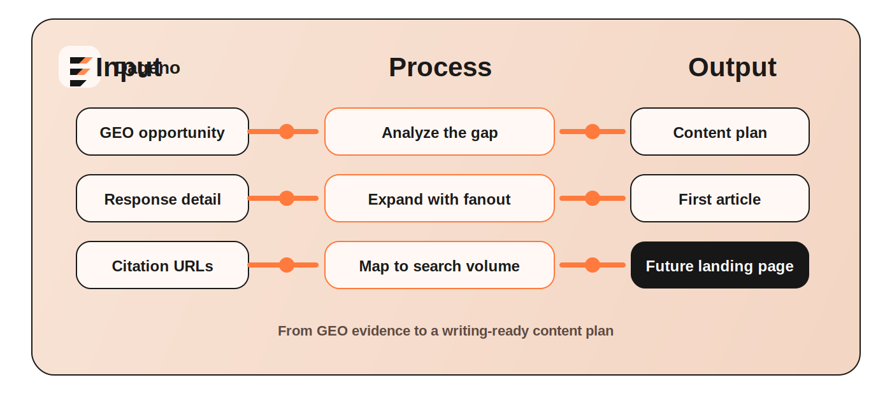
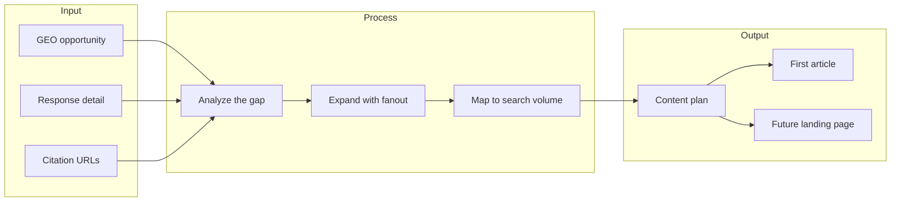

[](LICENSE)
[](skills/content-writer.md)
[](https://open-api-docs.dageno.ai/2055134m0)
[](examples/live-30-day-example.md)

# GEO Content Writer

<div align="center">
  <h2>content writer</h2>
  <p><strong>Turn GEO opportunities into a repeatable publishing system.</strong></p>
  <p>GEO Content Writer is a <strong>Content Writer Skill backed by a CLI runtime</strong>. It uses Dageno data to find high-value AI-search opportunities, explain why they matter, and turn them into a ready-to-use content plan.</p>
  <p><strong>Best for:</strong> GEO teams, agencies, AI visibility operators, and brands that want to automate article planning from real AI-search gaps.</p>
  <p><strong>Core output:</strong> one GEO opportunity in, one ready-to-use content plan out.</p>
  <p>
    <a href="https://open-api-docs.dageno.ai/2055134m0">Open API Docs</a> •
    <a href="skills/content-writer.md">Skill Instructions</a> •
    <a href="references/pipeline-spec.md">Workflow Reference</a> •
    <a href="schemas/output_schema.json">Output Schema</a> •
    <a href="examples/live-30-day-example.md">Live Example</a> •
    <a href="https://dageno.ai">Book a Demo</a> •
    <a href="https://www.linkedin.com/company/dageno-ai">LinkedIn</a> •
    <a href="https://x.com/dageno_ai">X</a> •
    <a href="https://join.slack.com/t/dagenoai/shared_invite/zt-3t3pk34g4-2vpE90vKJ~jBTc31Z0bT8A">Slack Community</a>
  </p>
</div>



## What It Does

This project turns one GEO opportunity into:

- a lightweight content pack
- a unified asset table
- a first-asset draft

It starts from Dageno evidence instead of generic keyword brainstorming:

- brand gap
- source gap
- AI response patterns
- citation URLs
- fanout prompts
- search demand

The main value is simple:

> if AI is already shaping the narrative, what should the team publish next?

## Core Workflow

1. set the brand knowledge base in `knowledge/brand/brand-knowledge-base.json`
2. run `content-pack` to identify assets and publishing order
3. review the unified asset table
4. generate the first asset draft
5. edit and publish based on the article type

## 10-Second View

| Input | Output |
|---|---|
| one high-value GEO prompt opportunity from Dageno | one ready-to-use content plan |
| AI response detail | a clear explanation of what AI is saying now |
| citation URLs | a view of which sources are shaping that answer |
| fanout queries | nearby content opportunities |
| search volume from Dageno Open API | the SEO demand around those opportunities |
| one approved topic | the first article to write |

## Simple Flow



## Quick Start

### Basic opportunity view

```bash
cd geo-content-writer
python -m venv .venv
source .venv/bin/activate
pip install -r requirements.txt
export DAGENO_API_KEY="your-token"
PYTHONPATH=src python -m geo_content_writer.cli content-opportunities
```

### Full content pack

```bash
PYTHONPATH=src python -m geo_content_writer.cli content-pack
```

### Compact content pack

Use this when an external agent needs a shorter markdown summary first.

```bash
PYTHONPATH=src python -m geo_content_writer.cli content-pack --compact
```

### Full content pack (JSON output)

```bash
PYTHONPATH=src python -m geo_content_writer.cli content-pack --output-json
```

### Compact JSON summary

Use this when an external agent needs a short structured summary before deciding whether to read the full pack.

```bash
PYTHONPATH=src python -m geo_content_writer.cli content-pack --compact-json
```

### Standard brand knowledge base location

```bash
knowledge/brand/brand-knowledge-base.json
```

### Save the content pack to a file

```bash
PYTHONPATH=src python -m geo_content_writer.cli content-pack --output-file examples/content-pack.md
```

### Save JSON output to a file

```bash
PYTHONPATH=src python -m geo_content_writer.cli content-pack --output-json --output-file examples/content-pack.json
```

### Validate generated JSON output

```bash
PYTHONPATH=src python -m geo_content_writer.cli validate-output examples/content-pack.json
```

### Generate the first asset draft

```bash
PYTHONPATH=src python -m geo_content_writer.cli first-asset-draft --output-file examples/first-asset-draft.md
```

### Short aliases

```bash
PYTHONPATH=src python -m geo_content_writer.cli pack --compact
PYTHONPATH=src python -m geo_content_writer.cli draft-first
PYTHONPATH=src python -m geo_content_writer.cli pack --compact-json
PYTHONPATH=src python -m geo_content_writer.cli validate-pack examples/content-pack.json
PYTHONPATH=src python -m geo_content_writer.cli validate-kb knowledge/brand/brand-knowledge-base.json
```

### Generate one specific asset draft

```bash
PYTHONPATH=src python -m geo_content_writer.cli first-asset-draft --asset-id A2 --output-file examples/asset-a2-draft.md
```

### Use a brand knowledge base for consistent messaging

Purpose: keep brand positioning and guardrails consistent across all outputs.

```bash
PYTHONPATH=src python -m geo_content_writer.cli first-asset-draft --brand-kb-file knowledge/brand/brand-knowledge-base.json --output-file examples/first-asset-draft.md
```

### Validate the brand knowledge base

```bash
PYTHONPATH=src python -m geo_content_writer.cli validate-brand-kb knowledge/brand/brand-knowledge-base.json
```

### Target one prompt

```bash
PYTHONPATH=src python -m geo_content_writer.cli content-pack --prompt-text "Enterprise AEO solutions for brand authority"
```

### Change the time window when needed

```bash
PYTHONPATH=src python -m geo_content_writer.cli content-pack --days 7
```

## Project Structure

```text
geo-content-writer/
├── README.md
├── LICENSE
├── manifest.json
├── agents/
│   └── openai.yaml
├── skills/
│   └── content-writer.md
├── knowledge/
│   └── brand/
│       └── brand-knowledge-base.json
├── schemas/
│   └── output_schema.json
│   └── brand_knowledge_base_schema.json
├── references/
│   └── pipeline-spec.md
├── assets/
├── examples/
└── src/
```

## Technical Notes

This project is best understood as a **Content Writer Skill** backed by a **CLI runtime**.

- the skill defines the workflow rules
- the CLI executes the data and formatting steps
- the standard brand knowledge base lives at `knowledge/brand/brand-knowledge-base.json`
- external agents should warn if that file is missing before running the main workflow

## License

MIT
